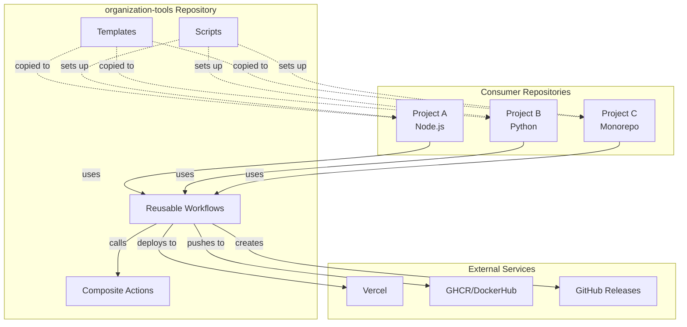
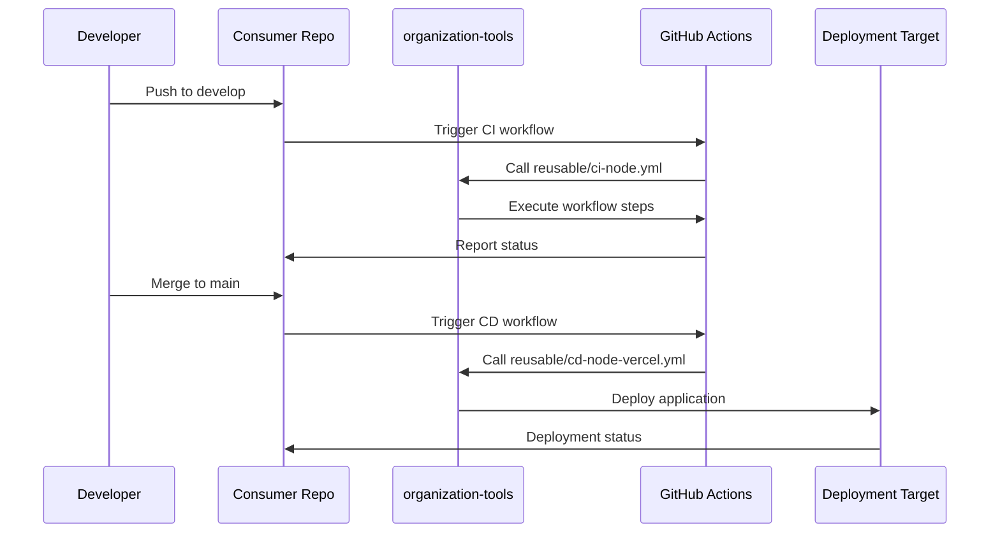
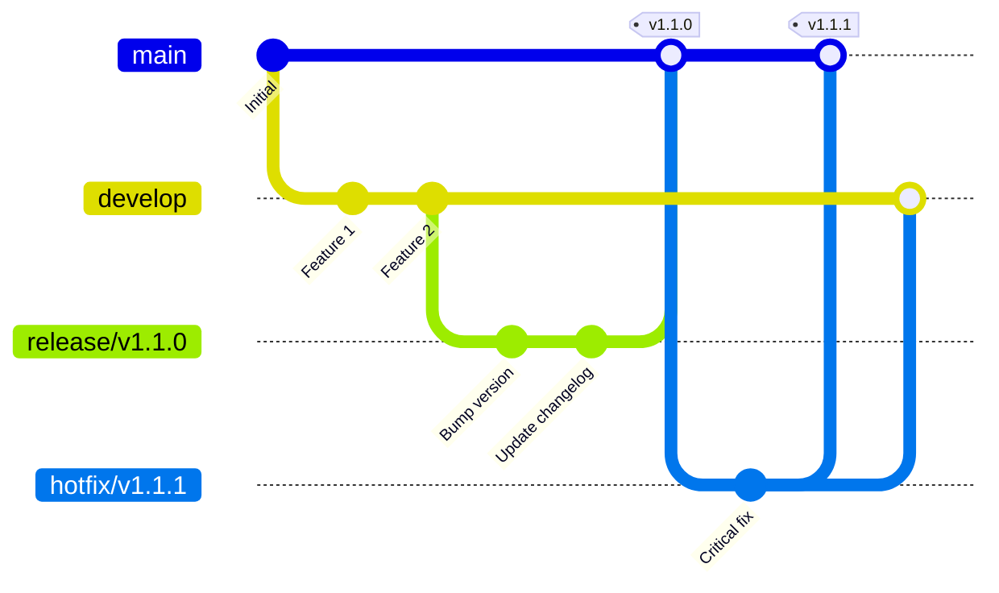

# CI/CD Architecture

## Overview

Centralized CI/CD system using GitHub Actions reusable workflows to ensure consistency, maintainability, and ease of updates across all organization repositories.

## Architecture Diagram



## Components

### 1. Reusable Workflows

**Location**: `.github/workflows/reusable/`

Workflows that can be called from other repositories using `workflow_call` trigger.

#### CI Workflows

- **ci-node.yml**: Comprehensive Node.js CI
  - Supports: pnpm, npm, yarn, bun
  - Features: lint, typecheck, test, build
  - Configurable via inputs
  - Uploads coverage and artifacts

- **ci-python.yml**: Python CI pipeline
  - Supports: pip, poetry, pipenv
  - Features: lint, test, type checking
  - Multiple Python versions

#### CD Workflows

- **cd-node-vercel.yml**: Deploy Node.js to Vercel
  - Production and preview deployments
  - Environment variable support
  - Deployment status reporting

- **cd-python-docker.yml**: Build and push Docker images
  - Multi-platform builds (amd64, arm64)
  - GHCR and DockerHub support
  - Image scanning and SBOM generation

#### Release Workflows

- **release-prepare.yml**: Prepare release branch
  - Version bumping (semver)
  - Changelog generation
  - PR creation

- **release-publish.yml**: Publish release
  - Git tagging
  - GitHub Release creation
  - Artifact publishing

- **hotfix-create.yml**: Create hotfix branch
  - Emergency fix workflow
  - Auto-merge to develop

**Advantages**:
- ✅ Single source of truth
- ✅ Automatic updates for all consumers
- ✅ Consistent behavior across projects
- ✅ Easy to maintain and test
- ✅ Version control via git tags

### 2. Composite Actions

**Location**: `.github/actions/`

Reusable action steps that can be composed into workflows.

- **setup-node-pnpm**: Node.js + pnpm setup with caching
- **setup-python**: Python setup with multiple package managers
- **setup-bun**: Bun runtime setup
- **setup-docker**: Docker buildx with multi-platform support

**Benefits**:
- Encapsulate common setup logic
- Reduce duplication across workflows
- Easier to test and maintain
- Consistent environment setup

### 3. Templates

**Location**: `.github/workflows/templates/`

Ready-to-copy workflow files for new repositories.

Templates call reusable workflows with sensible defaults:

```yaml
jobs:
  ci:
    uses: ArkeonProject/organization-tools/.github/workflows/reusable/ci-node.yml@main
    with:
      node-version: '20'
      package-manager: 'pnpm'
```

**Purpose**:
- Quick repository setup
- Standardized configuration
- Easy customization via inputs

### 4. Scripts

**Location**: `scripts/`

Automation tools for repository management.

- **setup-repo.sh**: Automated repository initialization
  - Clones/creates repository
  - Copies templates
  - Sets up branch structure
  - Configures CODEOWNERS
  - Supports dry-run and interactive modes

- **validate-workflows.sh**: Workflow validation
  - YAML syntax checking
  - GitHub Actions linting
  - Common issue detection

## Data Flow



## Branching Model



### Branch Rules

1. **main** (production)
   - Protected: 2 required approvals
   - Required status checks
   - No direct commits
   - Only accepts merges from release/* and hotfix/*

2. **develop** (integration)
   - Protected: 1 required approval
   - Required status checks
   - No direct commits
   - Accepts merges from feature/* and bugfix/*

3. **feature/*** (new features)
   - Branch from: develop
   - Merge to: develop
   - Naming: `feature/short-description`

4. **bugfix/*** (bug fixes)
   - Branch from: develop
   - Merge to: develop
   - Naming: `bugfix/short-description`

5. **release/*** (releases)
   - Branch from: develop
   - Merge to: main
   - Auto-created by workflow
   - Naming: `release/vX.X.X`

6. **hotfix/*** (emergency fixes)
   - Branch from: main
   - Merge to: main + develop
   - Auto-created by workflow
   - Naming: `hotfix/vX.X.X`

### Critical Rules

> [!IMPORTANT]
> **NEVER** merge develop → main directly  
> **NEVER** merge main → develop directly

Always use release or hotfix branches for controlled deployments.

## Security

### Branch Protection

- **main**: 2 reviewers, required checks, no force push
- **develop**: 1 reviewer, required checks, no force push

### Secrets Management

- Secrets stored at organization or repository level
- Never hardcoded in workflows
- Passed via `secrets` context
- Rotated regularly

### Dependency Management

- Dependabot enabled for all repos
- Automated security updates
- Weekly dependency updates
- Auto-merge for minor/patch updates

### Workflow Security

- Pinned action versions (e.g., `@v4`)
- Minimal permissions (GITHUB_TOKEN)
- No arbitrary code execution
- Input validation

## Scalability

### Multi-Platform Support

- Docker builds: linux/amd64, linux/arm64
- Node.js: Multiple package managers
- Python: Multiple dependency managers

### Monorepo Support

- Working directory configuration
- Selective workflow triggers
- Path-based filtering

### Performance Optimization

- Dependency caching
- Parallel job execution
- Conditional step execution
- Artifact reuse

## Monitoring and Observability

### Workflow Insights

- Job summaries with status tables
- Build artifact uploads
- Coverage reports
- Deployment status

### Notifications

- PR status checks
- Deployment comments
- Release notifications
- Failure alerts

## Maintenance

### Updating Workflows

1. Make changes in organization-tools
2. Test in a sandbox repository
3. Create PR to develop
4. Merge after review
5. All consumer repos automatically use updated version

### Versioning Strategy

- Use git tags for major versions
- Consumers can pin to specific versions:
  ```yaml
  uses: ArkeonProject/organization-tools/.github/workflows/reusable/ci-node.yml@v1.0.0
  ```
- Or use `@main` for latest

### Deprecation Process

1. Announce deprecation in CHANGELOG
2. Provide migration guide
3. Keep deprecated version for 3 months
4. Remove after grace period

---

**Last Updated**: 2025-12-06  
**Maintainer**: @daviilpzDev

